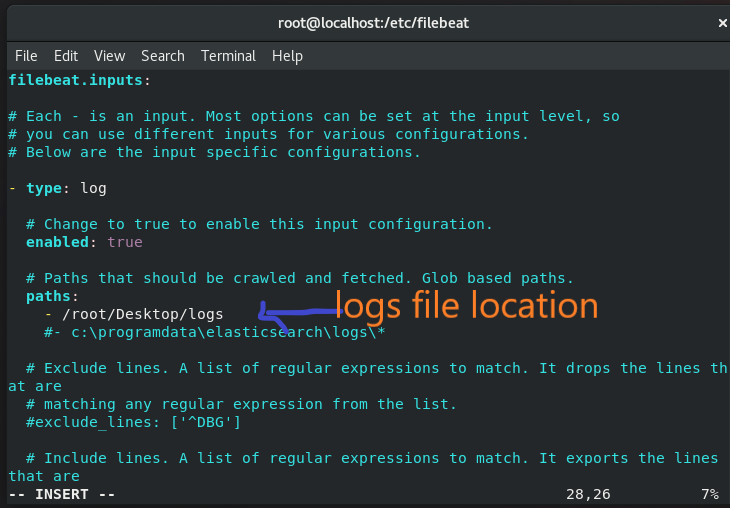
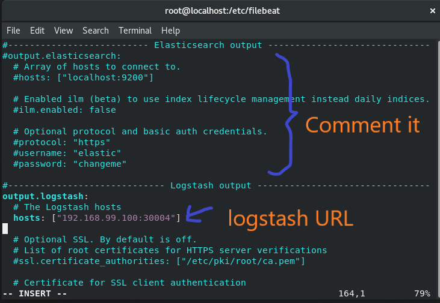
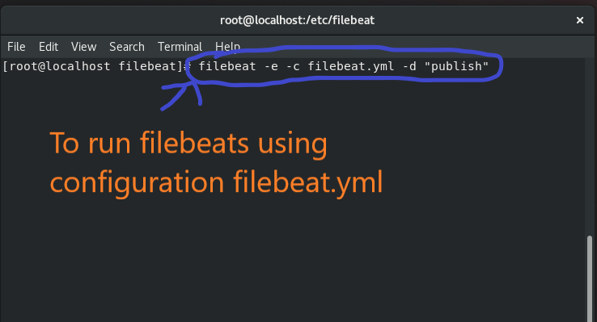
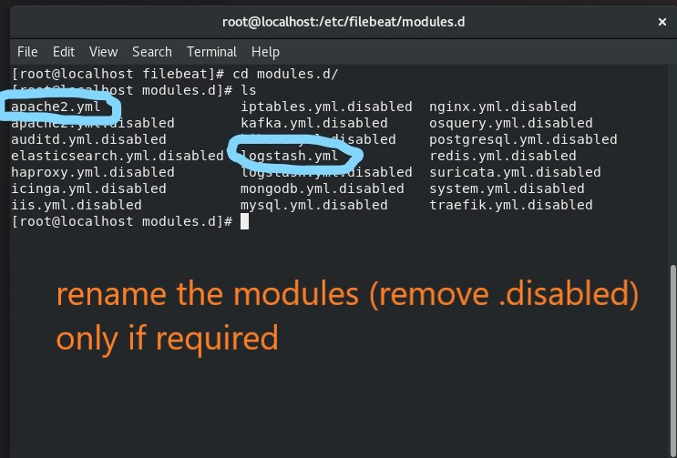

# ELK/ELASTIC Stack on Kubernetes cluster

(ElasticSearch, LogStash, Kibana) + bonus FileBeats(logstash input plugin beats)

"**ELK**" is the acronym for three open source projects: Elasticsearch, Logstash, and Kibana. Elasticsearch is a search and analytics engine. Logstash is a server‑side data processing pipeline that ingests data from multiple sources simultaneously, transforms it, and then sends it to a "stash" like Elasticsearch. Kibana lets users visualize data with charts and graphs in Elasticsearch

**ElasticSearch**:  The open-source, distributed, RESTful, JSON-based search engine. Easy to use, scalable and flexible, it earned hyper-popularity among users and a company formed around it, you know, for search.

**LogStash & Kibana**:  A search engine at heart, users started using Elasticsearch for logs and wanted to easily ingest and visualize them. Enter Logstash, the powerful ingest pipeline, and Kibana, the flexible visualization tool.

**Beats/fileBeats**:  A family of lightweight, single-purpose data shippers into the ELK Stack equation. 

**Kubernetes**: Kubernetes is an open-source container orchestration engine for automating deployment, scaling, and management of containerized applications. The open-source project is hosted by the Cloud Native Computing Foundation (**[CNCF](https://www.cncf.io/about)).**

## SETUP ELASTIC SEARCH:

> It is needed to be created first as it contains the database, before doing   anything we must have database to actually store the logs

> Created a PVC, Service, and deployment as shown below

> Change the size according to your need and resources

> Code for PVC(dynamic):

   es_vol.yml______________________________________

       apiVersion: v1
       kind: PersistentVolumeClaim
       metadata:
         name: es-vol
         labels: 
           app: elasticsearch
       spec:
         accessModes:
         - ReadWriteOnce
         resources:
           requests:  
             storage: 
               2Gi    

> **Note**:  here Service name must be elasticsearch, because the logstash and kibana will by default contact to Service named elasticsearch for their working

>  Code for Service and Deployment:

   Elasticsearch.yml__________________________________

       ---
       apiVersion: v1
       kind: Service
       metadata:
         name: elasticsearch
         labels:
           app: elasticsearch
       spec:
         selector:
           app: elasticsearch
         type: NodePort
         ports:
         - port: 9200
           targetPort: 9200
           nodePort: 30001
       ---

       apiVersion: apps/v1
       kind: Deployment
       metadata:
         name: es-deploy
         labels:
           app: elasticsearch
       spec:
         replicas: 1
         selector:
           matchLabels:
             app: elasticsearch
         template:
           metadata:
             name: es-pod
             labels:
               app: elasticsearch
           spec:
             containers:
             - name: es-con
               image: elasticsearch:7.7.1
               env:
               - name: "discovery.type"
                 value: "single-node"
               volumeMounts:
               - name: elastic-storage
                 mountPath: /var/lib/elasticsearch
             volumes:
             - name: elastic-storage
               persistentVolumeClaim:
                 claimName: es-vol

## SETUP KIBANA:

> Creating Service and Deployment :

   Kibana.yml_______________________________________

        ---
       apiVersion: v1
       kind: Service
       metadata:
         name: kibana-service
         labels:
           app: kibana
       spec:
         selector:
           app: kibana
         type: NodePort
         ports:
         - port: 5601
           targetPort: 5601
           nodePort: 30002
       ---

       apiVersion: apps/v1
       kind: Deployment
       metadata:
         name: kibana-deploy
         labels:
           app: kibana
       spec:
         replicas: 1
         selector:
           matchLabels:
             app: kibana
         template:
           metadata:
             name: kibana-pod
             labels:
               app: kibana
           spec:
             containers:
             - name: kibana-con
               image: kibana:7.7.1

## SETUP LOGSTASH:

> Creating configMap for managing logstash pipeline

> Here I have used beats for input

> and applied filters considering the logs to be apache log

> Please Note the indentation here as below:

     data:
         logstash.conf:  |-
                  &lt;pipeline file data(all the lines must be indented)>

logstash.conf___________________________________________

       apiVersion: v1
       kind: ConfigMap
       metadata:
         name: logstash-conf
         labels:
           app: logstash
       data:
           logstash.conf: |-

               input {
                 beats {
                   port => 5044
                 }
               }
               filter {
                 grok {
                   match => [ "message" , "%{COMBINEDAPACHELOG}"]
                 }
                 mutate {
                   convert => ["bytes", "integer"]
                 }
                 geoip {
                   source => "clientip"
                 }
                 date {
                   match => [ "timestamp" , "dd/MMM/YYYY:HH:mm:ss Z" ]
                   locale => en
                   remove_field => [ "timestamp" ]
                 }
                 useragent {
                   source => "agent"
                   target => "useragent"
                 }
               }
               output {
                 elasticsearch {
                   hosts => ["elasticsearch"]
                   index => "webdb"
                   document_type=> "weblog" 
                 }
                 stdout {
                    codec => "rubydebug"
                 }
               }

> There are also some other ways to generate configMap directly using configuration file you can use that by i find this way the best suitable for me so i used it

> Now Creating Service and Deployment:

> Expose two ports one for connecting to Beats and other for giving info about logstash(using browser)

logstash.yml__________________________________________

       ---
       apiVersion: v1
       kind: Service
       metadata:
         name: logstash-service
         labels:
           app: logstash
       spec:
         selector:
           app: logstash
         type: NodePort
         ports:
         - name: logstash-beats
           port: 5044
           targetPort: 5044
           nodePort: 30004
         - name: logstash-monitor
           port: 9600
           targetPort: 9600
           nodePort: 30003
       ---

       apiVersion: apps/v1
       kind: Deployment
       metadata:
         name: logstash-deploy
         labels:
           app: logstash
       spec:
         replicas: 1
         selector:
           matchLabels:
             app: logstash
         template:
           metadata:
             name: logstash-pod
             labels:
               app: logstash
           spec:
             containers:
             - name: logstash-con
               image: logstash:7.7.1
               volumeMounts:
               - name: config-volume
                 mountPath: /usr/share/logstash/pipeline
               ports:
                   - name: beats
                     containerPort: 5044
                   - name: logstash
                     containerPort: 9600
             volumes:
             - name: config-volume
               configMap:
                 name: logstash-conf

    

**Creating Kustomization:**

> Finally creating Kustomization for creating al the setup in one go 

Kustomization.yml____________________________________

       apiVersion: kustomize.config.k8s.io/v1beta1
       kind: Kustomization
       resources:
       - volumes/es_vol.yml
       - config/logstash-conf.yml
       - deploy/elasticsearch.yml
       - deploy/kibana.yml
       - deploy/logstash.yml

**Now to Launch whole setup in one go use the command:**

         kubectl create -k .

## BONUS: FileBeats setup**

> previously i told you about using beats to get data, and give it to logstash

> so first Question is why we require beats

              Because Beats provide better way to transfer data/logs

> then why don’t we use Beats directly to send data to elasticsearch

              Because of the filter option is provided by logstash is very effective for filtering logs,

> Install the filebeat on the system generating logs

> Configure filebeat.yml:(change the following(please see each line if pics carefully) in configuration file)

> If above command fail you might need to perform below step, if you still face any error your can feel free to contact me or see the documentation

